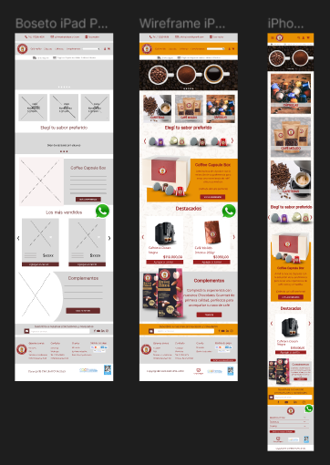
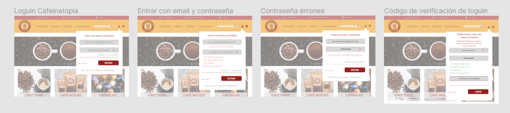
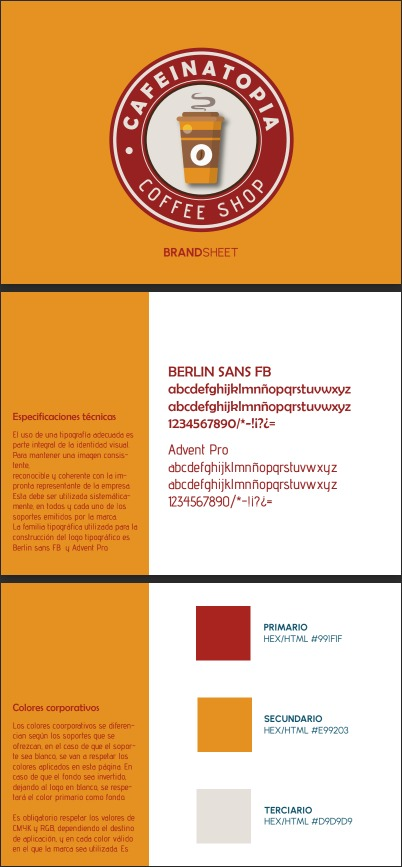

## CAFEINATOPIA Coffee Shop

>**CAFEINATOPIA** es una tienda online en donde podrás disfrutar de una amplia variedad de café en granos y en capsulas de _alta calidad_, explorar y saborear el mundo del café desde la comodidad de sus propios hogares.
> Contamos con cafeteras compatibles con Dolce Gusto y Nespresso que nos abren una abanico infinito de posibilidades, ofreciendo a nuestros clientes una _experiencia de consumo única_.

>Somos los creadores de  Coffee Capsule Box que te permite personalizar tu experiencia de café. Puedes seleccionar y combinar diferentes sabores de nuestras cápsulas para armar tu caja de café ideal, adaptada a tus gustos personales.
>Este revolucionario sistema nos permite asegurar un alcance de publico general, garantizando diferentes experiencias de consumo sin perder _deliciosos **sabores y aromas**_.

---

## INTEGRANTES

**Johana Uva Albarracin**, edad 29 años vivo en la ciudad de trenque lauquen y actualmente estoy estudiando programacion web full stak

**René Chumacero**, tengo 37 años y vivo en la cuida de salta y actualmente estoy cursando la carrera de desarrollo full stack

**Jairo Abarca Caravaca**, tengo 34 años mi ocupación actual es de Personal de Salud, vivo en Hurlingham y actualmente estoy cursando la carrera de desarrollo full stack

**Natalia Bevacqua**, tengo 48 años y vivo en Remedios de Escalada, Prov, de Buenos Aires. Soy especialista en marketing digital y fundadora de April Comunicaciones,  agencia de Marketing Digital y ecommerce. Mi enfoque principal se centra en el ecommerce y la transformación digital. Además, tengo la responsabilidad de coordinar el área de tutores en el eCommerce Institute, donde contribuyo a que otros profesionales aprendan y crezcan en este campo. Me apasiona la innovación y siempre me mantengo al tanto de las últimas tendencias en marketing digital.

**Lautaro Garcia**, tengo 27 años, vivo en Ituzaingo, Provincia de Buenos Aires. Actualmente me encuentro trabajando en la industria textil y cursando la carrera de desarrollo full stack. Me apasiona aprender nuevas herramientas de la tecnologia y como esta puede ser usada para impactar en la vida de las personas.

---

## Buscar inspiracion en referentes del mercado

#### ·Por los productos o servicios que ofrecen
Presentamos una lista de 5 sitios de referencia que hemos seleccionado para inspirarnos en la creación de nuestra página de venta de café. Cada sitio fue elegido por razones específicas que consideramos relevantes para nuestro proyecto:

Martínez (https://www.cafemartinez.com.ar/)
   - Elegimos Café Martínez debido a su excelente diseño y experiencia de usuario. Nos inspira la forma en que presentan sus productos y cuentan la historia de su café.

Coffee Break (https://www.coffeebreak.com/)
   - Coffee Break se destaca por su enfoque en la comunidad del café. Hemos elegido este sitio porque nos gusta cómo promueven la cultura del café y ofrecen contenido relacionado.

Gimoka (https://gimoka.com/)
   - Gimoka es conocido por su compromiso con la calidad del café. Lo seleccionamos por su enfoque en la sostenibilidad y la transparencia en la cadena de suministro.

Modo Bartista (https://www.modobartista.com/)
   - Modo Bartista es un referente en la industria del café de especialidad. Nos atrae su estilo de marca y cómo destacan los perfiles de sabor de sus granos.

Cafe Delirante (https://www.cafedelirante.com/)
   - Elegimos Cafe Delirante por su énfasis en la educación del café. Nos inspira su compromiso con la capacitación de baristas y consumidores.

Estos sitios nos servirán como fuentes de inspiración y referencia a medida que desarrollamos nuestra propia tienda en línea de café de especialidad.

#### ·Por los clientes a los que apuntan

La venta de café en línea apunta a diversos tipos de clientes, ya que el café es una bebida popular que atrae a una amplia audiencia.

Amantes del café gourmet: Personas que buscan café de alta calidad, con sabores y aromas distintivos. Estos clientes pueden estar dispuestos a pagar más por café premium.

Consumidores regulares de café: Aquellos que beben café a diario y buscan una fuente confiable de suministros frescos y sabrosos.

Empresas y oficinas: Muchas empresas compran café a granel para proporcionar a sus empleados. Puedes apuntar a oficinas que buscan opciones de café de calidad para sus empleados.

Cafeterías y restaurantes: Establecimientos de alimentos y bebidas que desean ofrecer café de alta calidad a sus clientes.

Amantes de la cafeína: Personas que buscan una amplia variedad de café con diferentes niveles de cafeína, desde descafeinado hasta café con un alto contenido de cafeína.

Regalos y ocasiones especiales: Personas que compran café en línea como regalo o para ocasiones especiales, como cumpleaños, aniversarios o Navidad.

Suscriptores de café: Puedes ofrecer programas de suscripción mensual que envíen café fresco de manera regular a los clientes que se suscriban.

Eco-conscientes: Clientes que buscan café que sea producido de manera sostenible y amigable con el medio ambiente.
Aventureros culinarios: Personas que disfrutan explorando diferentes orígenes y métodos de preparación de café, como café de especialidad o métodos de preparación alternativos, como el cold brew o el pour-over.
Personas ocupadas: Aquellas que valoran la conveniencia de recibir café fresco en la puerta de su casa sin tener que desplazarse a una tienda física.

#### ·Por la estética que presentan

https://www.coffeebreak.com.ar/

https://www.cafemartinez.com/

https://macchiato.com.ar/

https://www.thecoffeestore.com/

---

## Crear un wireframe y un boceto del sitio

### - Home

https://www.figma.com/file/QPJLixWdGW275bCajYcMnH/Untitled?type=design&node-id=0%3A1&mode=design&t=K5A3lioqgCVX7Flb-1

### - Detalle de Producto

https://www.figma.com/file/tn6G0TuBWDBpKs9kSauQtl/Untitled?type=design&node-id=0%3A1&mode=design&t=xocniJYWWoez54GP-1

### - Carrito de compras

https://www.figma.com/file/X5C9mmjrZsKauEA1JD1DUb/Wireframe-Carrito?type=design&node-id=0%3A1&mode=design&t=1s14X4SajLMrvlp1-1

### - Formulario de registro

https://www.figma.com/file/pNCruL0OQMKcNotnhinP8X/Untitled?type=design&mode=design&t=1s14X4SajLMrvlp1-1

### - Formulario de loguin

https://www.figma.com/file/Ne03hhqiPLW1Oov3je5E3N/Prototipo-interactivo-de-p%C3%A1gina-web-para-personas-con-dificultades-visuales-(Community)?type=design&node-id=303%3A42&mode=design&t=5qvp6yVUqVbG75c8-1

### - Brand Sheet de la marca(Logo, Colores y Tipografías)
Brand Sheet CAFEINATOPIA - COFFEE SHOP.pdf

